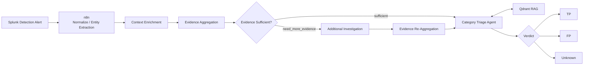
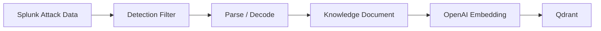
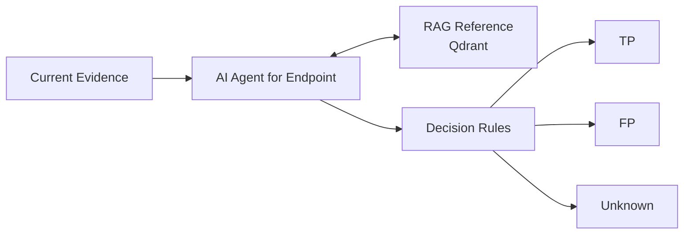

# AI-SOC

AI 기반 SOC 자동화 체계 연구 프로젝트

Splunk, n8n, LLM을 연계하여 **Alert Triage, Context Enrichment, 침해사고 분석 및 대응 자동화**를 연구합니다.

<p align="left">
  
  
  
  
</p>

> Splunk Alert 기반 Context Enrichment, Adaptive Investigation, RAG 연동을 통해  
> 보안 이벤트의 분석과 Triage를 자동화하는 Agent 기반 AI-SOC 프로젝트입니다.

---

## Overview


기존 SOC 환경에서는 탐지 이벤트 발생 이후 보안 분석가가 직접 관련 로그를 조회하고,
Context를 수집한 뒤 True Positive / False Positive 여부를 판단합니다.

AI-SOC는 이러한 분석 과정을 자동화하기 위해 설계되었습니다.

Splunk에서 발생한 Alert를 수집하고, 이벤트를 정규화한 뒤 관련 Context와 IoC 정보를 보강합니다.
수집된 Evidence가 충분한지 AI Agent가 판단하고, 필요한 경우 추가 Splunk 조사를 수행합니다.

최종적으로 Category별 AI Agent가 현재 사건에서 수집된 Evidence와
Qdrant에 저장된 RAG Knowledge를 함께 참고하여 다음 Verdict를 산출합니다.

- `TP` — True Positive
- `FP` — False Positive
- `Unknown` — 추가적인 판단 근거가 필요한 상태

---

## Key Features

### Splunk Detection Integration

Splunk Detection 결과를 n8n Workflow로 전달하여 AI 분석 Pipeline을 시작합니다.

Detection 단계에서 다음 Metadata를 함께 전달합니다.

```text
detection_id
detection_name
soc_category
mitre_technique
```

---

### Context Enrichment

Alert 자체의 정보만으로 판단하지 않고 관련 데이터를 추가 조회합니다.

주요 Enrichment 대상은 다음과 같습니다.

```text
Host
User
Process
Parent Process
IP
Domain
Hash
AWS Account / Resource
Authentication Context
Network Context
```

내부 데이터는 Splunk Search를 기반으로 수집하고,
외부 IoC 정보가 필요한 경우 External IoC Investigation Agent를 활용할 수 있도록 구성했습니다.

---

### Evidence Aggregation

각 단계에서 수집한 데이터를 하나의 Evidence 구조로 병합합니다.

```text
Original Alert
+
Detection Metadata
+
Internal Context
+
External IoC Context
+
Investigation Result
=
Aggregated Evidence
```

최종 AI Agent는 흩어진 원본 로그를 직접 분석하는 대신
구조화된 Evidence를 입력으로 사용합니다.

---

### Adaptive Investigation

AI Agent가 바로 TP / FP를 결정하지 않고
현재 Evidence만으로 판단이 가능한지 먼저 검증합니다.

```text
investigation_status
├── sufficient
└── need_more_evidence
```

`need_more_evidence`가 반환되면 Splunk에서 추가 데이터를 검색합니다.

추가 조사 시 전체 Raw Event를 다시 LLM에 전달하지 않고
분석에 필요한 통계 및 요약 데이터를 전달하도록 구성했습니다.

```text
Initial Evidence
        ↓
   1st AI Agent
        ↓
Evidence Sufficiency Check
        │
        ├── sufficient
        │       ↓
        │   Triage Agent
        │
        └── need_more_evidence
                ↓
        Additional Investigation
                ↓
          Statistical Summary
                ↓
        Evidence Re-Aggregation
                ↓
          Triage Agent
```

이를 통해 불필요한 Token 사용을 줄이고
Evidence가 부족한 상태에서 AI가 판단을 강행하는 것을 방지합니다.

---

## Architecture



---

## Analysis Flow

전체 분석 Pipeline은 다음 단계로 구성됩니다.

```text
1. DETECT
   Splunk Detection
   ↓
   Alert Ingestion

2. ENRICH
   Normalization
   ↓
   Entity Extraction
   ↓
   Context Enrichment

3. INVESTIGATE
   Evidence Aggregation
   ↓
   Evidence 충분성 판단
   ↓
   필요 시 Additional Investigation
   ↓
   Evidence Re-Aggregation

4. TRIAGE
   Category-specific AI Agent
   ↕
   Qdrant RAG Knowledge

5. DECIDE
   TP / FP / Unknown
```

---

## Detection Scenarios

AI-SOC 분석 구조를 검증하기 위해 다음 Detection Scenario를 구성했습니다.

| Detection ID | SOC Category | Detection | MITRE / Behavior |
|---|---|---|---|
| `END-001` | Endpoint | Encoded PowerShell | T1027 |
| `END-002` | Endpoint | Local Administrator Creation | T1136 |
| `NET-001` | Network | AWS Metadata Credential Access | T1552.005 |
| `AUTH-001` | Identity | Excessive AccessDenied | Brute-force / Abuse |
| `CLOUD-001` | Cloud | Unauthorized CreateAccessKey | T1098.001 |

---

## Category Triage Agent

보안 이벤트 유형별로 전문 Agent를 배치하는 구조를 사용합니다.

```text
Evidence Aggregation
        ↓
SOC Category Routing
        │
        ├── Endpoint
        │     └── AI Agent for Endpoint
        │
        ├── Network
        │     └── AI Agent for Network
        │
        ├── Identity
        │     └── AI Agent for Identity
        │
        └── Cloud
              └── AI Agent for Cloud
```

현재 구현에서는 **Endpoint Agent를 우선 구현하여 전체 구조를 검증했습니다.**

각 Category Agent는 해당 보안 영역의 Evidence를 중심으로 판단하며,
필요한 경우 Qdrant RAG Tool을 호출합니다.

---

# RAG

## Why RAG?

LLM이 현재 이벤트만 보고 판단하도록 하면
과거 공격 행위나 알려진 보안 패턴을 충분히 참고하기 어렵습니다.

AI-SOC에서는 RAG를 통해 공격 사례와 행위 정보를 검색할 수 있도록 구성했습니다.

하지만 RAG는 **현재 사건의 Evidence가 아닙니다.**

```text
Current Evidence
= 현재 Alert와 Investigation에서 실제로 관측된 사실

RAG Knowledge
= 과거 공격 데이터 및 분석에 참고할 수 있는 보안 지식
```

최종 Verdict는 항상 Current Evidence를 중심으로 결정합니다.

---

## RAG Knowledge Builder

초기 Knowledge Source로 **Splunk Attack Data**를 사용했습니다.

현재 END-001 Detection을 기준으로 실제 공격 데이터를 수집하고
Knowledge Document로 변환하는 Pipeline을 구현했습니다.



구체적인 처리 과정은 다음과 같습니다.

```text
Splunk Attack Data
        ↓
HTTP Request
        ↓
Detection-specific Filtering
        ↓
Event Parsing / Normalization
        ↓
PowerShell EncodedCommand Decode
        ↓
Knowledge Document Generation
        ↓
OpenAI Embedding
        ↓
Qdrant
```

---

## END-001 RAG Dataset

END-001 테스트에는 Splunk Attack Data의
T1027 Sysmon Dataset을 사용했습니다.

Filtering 조건:

```text
Sysmon Event ID = 1

AND

Process
= powershell.exe
OR pwsh.exe

AND

CommandLine
= EncodedCommand 계열 옵션 포함
```

처리 결과:

| Item | Result |
|---|---:|
| Total Events | 6,235 |
| Matched Events | 38 |
| Unique Commands | 13 |

PowerShell `EncodedCommand`의 Base64 Payload를 추출한 뒤
UTF-16LE 방식으로 Decode하도록 구현했습니다.

예:

```text
Encoded

dwBoAG8AYQBtAGkA

↓

Decoded

whoami
```

이를 통해 단순 Encoded 문자열이 아니라
실제로 실행된 PowerShell 명령을 RAG Knowledge에 포함할 수 있습니다.

---

## Knowledge Document

Splunk Attack Data의 Raw Event 전체를 그대로 Vector DB에 저장하지 않습니다.

RAG 검색에 필요한 정보로 가공하여 Knowledge Document를 생성합니다.

예:

```json
{
  "knowledge_id": "SAD-END001-001",
  "knowledge_type": "attack_case",
  "source": "splunk_attack_data",
  "detection_id": "END-001",
  "soc_category": "endpoint",
  "mitre_technique": "T1027",
  "attack_name": "Encoded PowerShell Execution"
}
```

Knowledge Document에는 다음 정보가 포함됩니다.

```text
Detection Information
MITRE ATT&CK
Observed Behavior
Dataset Statistics
Host
User
Process
Parent Process
Decoded Command
```

---

## Vector Database

Vector Database는 **Qdrant**를 사용합니다.

```text
Collection
ai_soc_knowledge

Embedding Model
text-embedding-3-small

Vector Dimension
1536

Distance
Cosine
```

---

## RAG Retrieval

Endpoint Triage Agent에 Qdrant Vector Store를 Tool로 직접 연결했습니다.

```text
AI Agent for Endpoint
        │
        ├── Current Evidence
        │
        └── Qdrant Vector Search
                    │
                    ▼
             ai_soc_knowledge
```

Agent는 현재 Alert의 주요 행위를 기반으로 검색 Query를 생성합니다.

예:

```text
PowerShell executed with EncodedCommand and Base64 payload.
Parent process is cmd.exe.
MITRE technique T1027.
Find similar known attack behavior.
```

관련 Knowledge가 검색되면 Agent가 현재 Evidence와 비교하여
최종 판단에 참고합니다.

---

## RAG Decision Rules

RAG 사용 시 다음 원칙을 적용합니다.

```text
1. RAG 검색 결과는 Reference Knowledge이다.

2. RAG 결과와 현재 Alert가 유사하다는 이유만으로
   True Positive로 확정하지 않는다.

3. Verdict의 핵심 근거는 Current Evidence이다.

4. RAG는 공격 패턴 비교와 Context 보강에 사용한다.

5. 검색 결과가 현재 사건과 관련이 없다면 사용하지 않는다.

6. Evidence가 충분하지 않으면 Unknown을 반환한다.

7. 현재 Evidence와 RAG에 존재하지 않는 사실을 생성하지 않는다.
```

---

## Evidence + RAG Decision Model



핵심 설계 원칙은 다음과 같습니다.

> **Current Evidence를 중심으로 판단하고, RAG Knowledge는 공격 사례 비교와 맥락 보강에만 사용합니다.**

---

# Tech Stack

| Area | Technology |
|---|---|
| SIEM / Detection | Splunk |
| Workflow Automation | n8n |
| AI Agent Orchestration | n8n AI Agent |
| LLM | OpenAI |
| Embedding | OpenAI `text-embedding-3-small` |
| Vector Database | Qdrant |
| Threat Knowledge | Splunk Attack Data |
| Container Environment | Docker / Docker Compose |
| Detection Framework | MITRE ATT&CK |

---
과거 진행 이력

##### 프로젝트 진행 흔적

- **현재:** Encoded PowerShell 시나리오 기반 Multi-Agent 침해사고 분석 PoC 구현
- **구현:** Triage → Investigation → Synthesis → Human-in-the-Loop 기반 대응 프로세스
- **보완:** PowerShell 중심 분석 구조를 다양한 Alert 유형에 적용 가능한 범용 구조로 확장
- **목표:** 다양한 보안 이벤트를 자율적으로 조사하고, 중요 대응은 분석가가 통제하는 SOC 자동화 체계 구축

##### 진행 일정
- 2026.07 ~ 2026.07 : Encode Powershell 시나리오 특화된 침해사고 분석 PoC
- 2026.08.01 ~ 2026.08.17 : Generic Triage Multi-Agent SOC Framework 기획
